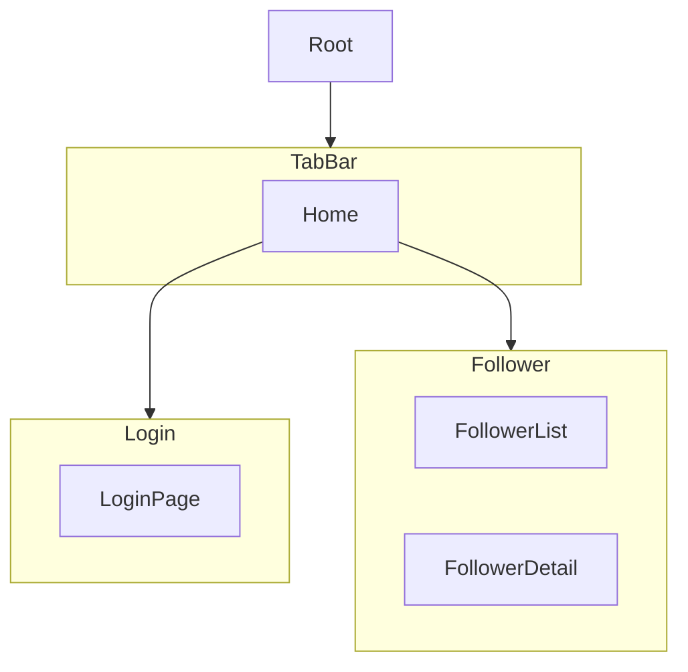

  

# mock-up-ribs
> 해당 프로젝트는 제가 기술 도입을 하면서 어떻게 적용시켰는지 공유하고자 만든 프로젝트입니다.
> RIBs 디자인 패턴, RxSwift, Swift Package Manager, Moya 등에 대한 내용들이 들어가 있습니다.
> 프로젝트는 유저 정보를 제공하는 페이크 API(typicode json-server 제공) 를 가지고 `로그인-로그아웃`, `유저 정보 조회` 등의 가상 시나리오를 작성했고, 이를 바탕으로 만들어졌습니다.

## ⚙️ 관련 기술 (Skills)
- 의존성 모듈 키트 관리(Swift Package Manager)
- 코드 베이스 레이아웃(SnapKit)
- RIBs 디자인 패턴 도입
- 전역데이터 관리 및 입력 검증 RxSwift 도입
- API 리퀘스트 모듈화(Moya)

## 📱 프로젝트의 주요 기능 (Features)
- 로그인-로그아웃
- 로그인 입력 검증
- 최근 방문 유저 저장

## 🗄️ 프로젝트 구조

## 📟 API 리퀘스트
- 도메인 (페이크 API)
    - https://github.com/typicode/json-server
